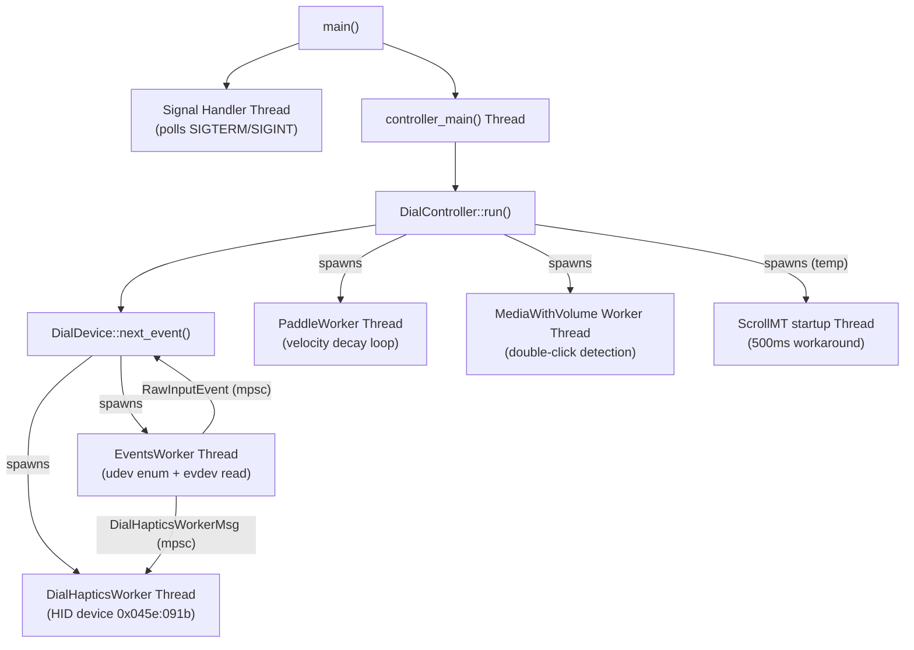
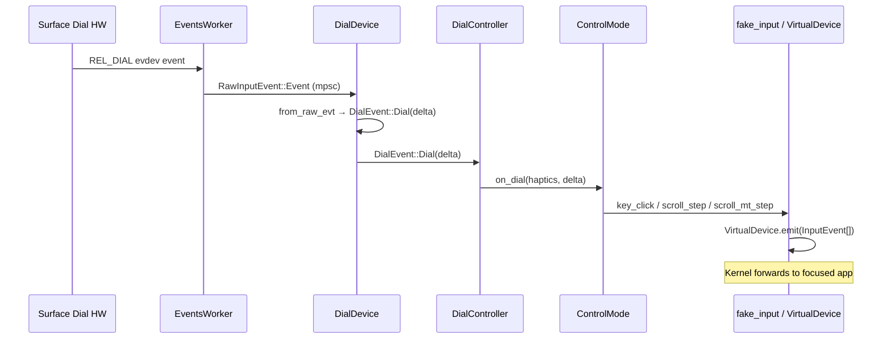

# Surface Dial Linux — Architecture UML

```mermaid
classDiagram
    %% ── Traits ─────────────────────────────────────────────────────────────
    class ControlMode {
        <<trait>>
        +meta() ControlModeMeta
        +on_start(haptics) Result
        +on_end(haptics) Result
        +on_btn_press(haptics) Result
        +on_btn_release(haptics) Result
        +on_dial(haptics, delta i32) Result
    }

    %% ── Control Mode Metadata ───────────────────────────────────────────────
    class ControlModeMeta {
        +name: String
        +icon: String
        +haptics: bool
        +steps: u16
    }

    %% ── Built-in Control Modes ──────────────────────────────────────────────
    class Scroll {
        +meta() ControlModeMeta
        +on_dial(haptics, delta) Result
    }
    class ScrollMT {
        -acc_delta: i32
        +meta() ControlModeMeta
        +on_start(haptics) Result
        +on_end(haptics) Result
        +on_btn_press(haptics) Result
        +on_btn_release(haptics) Result
        +on_dial(haptics, delta) Result
    }
    class Zoom {
        +meta() ControlModeMeta
        +on_dial(haptics, delta) Result
    }
    class Volume {
        +meta() ControlModeMeta
        +on_btn_release(haptics) Result
        +on_dial(haptics, delta) Result
    }
    class Media {
        +meta() ControlModeMeta
        +on_btn_release(haptics) Result
        +on_dial(haptics, delta) Result
    }
    class MediaWithVolume {
        -click_tx: Sender
        -release_tx: Sender
        -worker_handle: JoinHandle
        +meta() ControlModeMeta
        +on_btn_press(haptics) Result
        +on_btn_release(haptics) Result
        +on_dial(haptics, delta) Result
    }
    class Paddle {
        -_worker: JoinHandle
        -msg: Sender~Msg~
        +meta() ControlModeMeta
        +on_start(haptics) Result
        +on_end(haptics) Result
        +on_btn_press(haptics) Result
        +on_btn_release(haptics) Result
        +on_dial(haptics, delta) Result
        drop()
    }
    class ConfigMode {
        +name: String
        +icon: String
        +haptics: bool
        +steps: u16
        -btn_press: Vec~KeyCode~
        -btn_release: Vec~KeyCode~
        -dial_cw: Vec~KeyCode~
        -dial_ccw: Vec~KeyCode~
        +from_spec(spec) Result~Self~
        +meta() ControlModeMeta
        +on_btn_press(haptics) Result
        +on_btn_release(haptics) Result
        +on_dial(haptics, delta) Result
    }

    %% ── Controller ──────────────────────────────────────────────────────────
    class DialController {
        -device: DialDevice
        -modes: Vec~Box~ControlMode~~
        -active_mode: ActiveMode
        -new_mode: Arc~Mutex~Option~usize~~~
        -meta_mode: Box~ControlMode~
        +new(device, initial_mode, modes) DialController
        +run() Result
    }
    class ActiveMode {
        <<enumeration>>
        Normal(usize)
        Meta
    }
    class MetaMode {
        -metas: Vec~ControlModeMeta~
        -current_mode: usize
        -new_mode: Arc~Mutex~Option~usize~~~
        -first_release: bool
        -notif: Option~NotificationHandle~
        +on_start(haptics) Result
        +on_btn_release(haptics) Result
        +on_dial(haptics, delta) Result
    }

    %% ── Dial Device ─────────────────────────────────────────────────────────
    class DialDevice {
        -long_press_timeout: Duration
        -haptics: DialHaptics
        -events: Receiver~RawInputEvent~
        -possible_long_press: bool
        +new(timeout) Result~DialDevice~
        +next_event() Result~DialEvent~
        +haptics() DialHaptics
    }
    class DialEvent {
        +time: Duration
        +kind: DialEventKind
        +from_raw_evt(evt) Option~DialEvent~
    }
    class DialEventKind {
        <<enumeration>>
        Connect
        Disconnect
        Ignored
        ButtonPress
        ButtonRelease
        Dial(i32)
        ButtonLongPress
    }

    %% ── Events Worker ───────────────────────────────────────────────────────
    class EventsWorker {
        -events: Sender~RawInputEvent~
        -haptics_msg: Sender~DialHapticsWorkerMsg~
        -input_kind: DialInputKind
        +run() io::Result
        -event_loop(device) io::Result
        -udev_to_evdev(device) io::Result~Option~Device~~
    }
    class RawInputEvent {
        <<enumeration>>
        Event(InputEvent)
        Connect
        Disconnect
    }
    class DialInputKind {
        <<enumeration>>
        Control
        MultiAxis
    }

    %% ── Haptics ─────────────────────────────────────────────────────────────
    class DialHaptics {
        -msg: Sender~DialHapticsWorkerMsg~
        +new(msg) Result~DialHaptics~
        +set_mode(haptics, steps) Result
        +buzz(repeat) Result
    }
    class DialHapticsWorker {
        -msg: Receiver~DialHapticsWorkerMsg~
        +new(msg) Result~DialHapticsWorker~
        +run() Result
    }
    class DialHapticsWorkerMsg {
        <<enumeration>>
        DialConnected
        DialDisconnected
        SetMode(haptics, steps)
        Manual(repeat)
    }
    class DialHidWrapper {
        -hid_device: HidDevice
        +set_mode(haptics, steps) Result
        +buzz(repeat) Result
    }

    %% ── Fake Input ──────────────────────────────────────────────────────────
    class FakeInputs {
        <<singleton>>
        +keyboard: Mutex~VirtualDevice~
        +touchpad: Mutex~VirtualDevice~
    }
    class fake_input {
        <<module>>
        +parse_key_code(name) Option~KeyCode~
        +key_click(keys) io::Result
        +key_press(keys) io::Result
        +key_release(keys) io::Result
        +scroll_step(dir) io::Result
        +scroll_mt_start() io::Result
        +scroll_mt_step(delta) io::Result
        +scroll_mt_end() io::Result
    }
    class ScrollStep {
        <<enumeration>>
        Up
        Down
    }

    %% ── Config ──────────────────────────────────────────────────────────────
    class Config {
        +last_mode: usize
        +from_disk() Result~Config~
        +to_disk() Result
    }

    %% ── Error ───────────────────────────────────────────────────────────────
    class Error {
        <<enumeration>>
        ConfigFile(String)
        OpenDevInputDir(io::Error)
        OpenEventFile(PathBuf, io::Error)
        HidError(hidapi::HidError)
        MissingDial
        MultipleDials
        UnexpectedEvt(InputEvent)
        Evdev(io::Error)
        Notif(notify_rust::error::Error)
        TermSig
    }

    %% ── Paddle Worker ───────────────────────────────────────────────────────
    class PaddleWorker {
        -msg: Receiver~Msg~
        -velocity: i32
        -last_delta: i32
        -enabled: bool
        +run()
    }
    class PaddleMsg {
        <<enumeration>>
        Kill
        ButtonDown
        ButtonUp
        Delta(i32)
        Enabled(bool)
    }

    %% ── Relationships ───────────────────────────────────────────────────────

    %% ControlMode implementations
    ControlMode <|.. Scroll
    ControlMode <|.. ScrollMT
    ControlMode <|.. Zoom
    ControlMode <|.. Volume
    ControlMode <|.. Media
    ControlMode <|.. MediaWithVolume
    ControlMode <|.. Paddle
    ControlMode <|.. ConfigMode
    ControlMode <|.. MetaMode

    %% ControlMode returns metadata
    ControlMode ..> ControlModeMeta : returns

    %% Controller owns modes and device
    DialController *-- DialDevice : owns
    DialController o-- ControlMode : modes[]
    DialController *-- MetaMode : owns
    DialController *-- ActiveMode : active_mode
    DialController --> Config : reads/writes

    %% MetaMode shares new_mode Arc with DialController
    MetaMode ..> DialController : signals via Arc~Mutex~

    %% DialDevice owns haptics proxy and receives events
    DialDevice *-- DialHaptics : owns
    DialDevice ..> RawInputEvent : receives via mpsc
    DialDevice ..> DialEvent : produces
    DialEvent *-- DialEventKind

    %% EventsWorker sends to DialDevice and DialHapticsWorker
    EventsWorker ..> RawInputEvent : sends via mpsc
    EventsWorker ..> DialHapticsWorkerMsg : sends via mpsc
    EventsWorker *-- DialInputKind

    %% Haptics chain
    DialHaptics ..> DialHapticsWorkerMsg : sends via mpsc
    DialHapticsWorker ..> DialHapticsWorkerMsg : receives
    DialHapticsWorker *-- DialHidWrapper : creates when connected

    %% Paddle internal worker
    Paddle *-- PaddleWorker : spawns thread
    Paddle ..> PaddleMsg : sends via mpsc
    PaddleWorker ..> PaddleMsg : receives

    %% Fake input usage
    fake_input *-- FakeInputs : lazy_static
    fake_input *-- ScrollStep
    Scroll ..> fake_input : uses
    ScrollMT ..> fake_input : uses
    Zoom ..> fake_input : uses
    Volume ..> fake_input : uses
    Media ..> fake_input : uses
    MediaWithVolume ..> fake_input : uses
    Paddle ..> fake_input : uses
    ConfigMode ..> fake_input : uses
```

## Threading Model

```mermaid
graph TD
    main["main()"] --> sig["Signal Handler Thread\n(polls SIGTERM/SIGINT)"]
    main --> ctrl["controller_main() Thread"]

    ctrl --> dc["DialController::run()"]
    dc --> dd["DialDevice::next_event()"]

    dd -->|"spawns"| ew["EventsWorker Thread\n(udev enum + evdev read)"]
    dd -->|"spawns"| hw["DialHapticsWorker Thread\n(HID device 0x045e:091b)"]

    ew -->|"RawInputEvent (mpsc)"| dd
    ew -->|"DialHapticsWorkerMsg (mpsc)"| hw

    dc -->|"spawns"| pw["PaddleWorker Thread\n(velocity decay loop)"]
    dc -->|"spawns"| mw["MediaWithVolume Worker Thread\n(double-click detection)"]
    dc -->|"spawns (temp)"| sw["ScrollMT startup Thread\n(500ms workaround)"]
```

## Event Flow: Dial Rotation

```mermaid
sequenceDiagram
    participant HW as Surface Dial HW
    participant EW as EventsWorker
    participant DD as DialDevice
    participant DC as DialController
    participant CM as ControlMode
    participant FI as fake_input / VirtualDevice

    HW->>EW: REL_DIAL evdev event
    EW->>DD: RawInputEvent::Event (mpsc)
    DD->>DD: from_raw_evt → DialEvent::Dial(delta)
    DD->>DC: DialEvent::Dial(delta)
    DC->>CM: on_dial(haptics, delta)
    CM->>FI: key_click / scroll_step / scroll_mt_step
    FI->>FI: VirtualDevice.emit(InputEvent[])
    Note over FI: Kernel forwards to focused app
```
